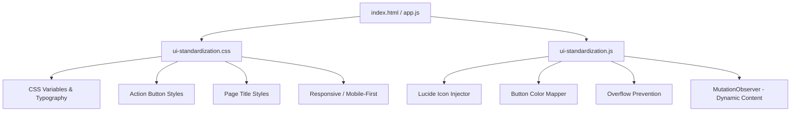

# Design Document: UI Standardization

## Overview

Implementasi standarisasi UI/UX menyeluruh pada aplikasi Manajemen Risiko. Pendekatan yang digunakan adalah membuat satu file CSS global terpusat (`public/css/ui-standardization.css`) dan satu file JS global (`public/js/ui-standardization.js`) yang di-load di semua halaman, menggantikan puluhan file CSS/JS patch yang sudah ada. Ini memastikan konsistensi tanpa mengubah logika bisnis yang sudah berjalan.

## Architecture



Strategi: **CSS-first dengan JS enhancement**. CSS menangani semua styling statis, JS hanya untuk konten yang dirender secara dinamis (tabel yang diisi via JavaScript).

## Components and Interfaces

### 1. CSS Variables System (`ui-standardization.css`)

Mendefinisikan ulang dan memperluas CSS variables yang sudah ada di `style.css`:

```css
:root {
  /* Typography */
  --font-primary: 'Inter', 'Segoe UI', sans-serif;
  --font-size-page-title: 1.5rem;
  --font-size-section-title: 1.25rem;
  --font-size-body: 0.9rem;
  --font-size-small: 0.8rem;
  --font-weight-bold: 700;
  --font-weight-semibold: 600;
  --font-weight-regular: 400;

  /* Action Button Colors */
  --btn-edit-bg: #EFF6FF;
  --btn-edit-border: #3B82F6;
  --btn-edit-text: #1D4ED8;
  --btn-delete-bg: #FEF2F2;
  --btn-delete-border: #EF4444;
  --btn-delete-text: #DC2626;
  --btn-view-bg: #F0FDF4;
  --btn-view-border: #22C55E;
  --btn-view-text: #16A34A;
  --btn-warning-bg: #FFFBEB;
  --btn-warning-border: #F59E0B;
  --btn-warning-text: #D97706;

  /* Spacing */
  --btn-action-padding: 5px 10px;
  --btn-action-radius: 6px;
  --btn-action-font-size: 0.8rem;
  --btn-action-icon-size: 14px;
}
```

### 2. Action Button System

Setiap tombol aksi menggunakan class standar:
- `.btn-action-edit` → biru
- `.btn-action-delete` → merah
- `.btn-action-view` → hijau
- `.btn-action-warning` → kuning/oranye
- `.btn-action-primary` → primary red (tema)

Semua tombol memiliki: ikon Lucide + teks label + warna solid + ukuran konsisten.

### 3. Page Title System

Format standar judul halaman:
```html
<div class="page-header-standard">
  <div class="page-title-wrapper">
    <i data-lucide="[icon-name]" class="page-title-icon"></i>
    <h1 class="page-title-text">[Judul Halaman]</h1>
  </div>
</div>
```

### 4. Typography System

Font stack: `'Inter', 'Poppins', 'Segoe UI', Tahoma, sans-serif`

Hierarki:
- `.page-title-text`: 1.5rem, weight 700
- `.section-title`: 1.25rem, weight 600
- `th` (header tabel): 0.85rem, weight 600, uppercase
- `td` (isi tabel): 0.875rem, weight 400
- `.btn-action-*`: 0.8rem, weight 500
- `label`: 0.875rem, weight 600

### 5. Overflow Prevention System

- Semua `td` dan `th`: `max-width: 200px; overflow: hidden; text-overflow: ellipsis; white-space: nowrap`
- Tabel wrapper: `overflow-x: auto`
- Tombol aksi: `white-space: nowrap; flex-shrink: 0`
- Judul halaman: `overflow: hidden; text-overflow: ellipsis; white-space: nowrap`

### 6. Mobile-First Responsive

Breakpoints:
- Mobile: `< 768px` → font lebih kecil, tombol full-width, tabel scroll horizontal
- Tablet: `768px - 1024px` → layout 2 kolom
- Desktop: `> 1024px` → layout penuh

## Data Models

### Icon Mapping (JS)

```javascript
const PAGE_ICONS = {
  'dashboard': 'layout-dashboard',
  'visi-misi': 'eye',
  'analisis-swot': 'bar-chart-2',
  'matriks-tows': 'grid',
  'diagram-kartesius': 'crosshair',
  'sasaran-strategi': 'target',
  'indikator-kinerja-utama': 'activity',
  'rencana-strategis': 'map',
  'risk-input': 'alert-triangle',
  'risk-register': 'clipboard-list',
  'risk-profile': 'shield',
  'kri': 'trending-up',
  'residual-risk': 'shield-check',
  'monitoring-evaluasi': 'check-square',
  'peluang': 'star',
  'laporan': 'file-text',
  'buku-pedoman': 'book-open',
  'master-data': 'database',
  'pengaturan': 'settings'
};

const ACTION_ICONS = {
  'edit': 'pencil',
  'delete': 'trash-2',
  'view': 'eye',
  'add': 'plus',
  'save': 'save',
  'download': 'download',
  'print': 'printer',
  'approve': 'check-circle',
  'reject': 'x-circle'
};
```

## Correctness Properties

*A property is a characteristic or behavior that should hold true across all valid executions of a system — essentially, a formal statement about what the system should do. Properties serve as the bridge between human-readable specifications and machine-verifiable correctness guarantees.*

### Property 1: Tidak Ada Overflow pada Elemen UI

*For any* elemen tombol aksi, judul halaman, atau sel tabel yang dirender, elemen tersebut tidak boleh memiliki `scrollWidth > clientWidth` (overflow horizontal) tanpa mekanisme scroll yang tepat.

**Validates: Requirements 1.4, 3.5, 4.4, 5.1**

### Property 2: Konsistensi Warna Tombol Aksi

*For any* tombol dengan class `.btn-action-edit`, `.btn-action-delete`, `.btn-action-view`, atau `.btn-action-warning`, warna background, border, dan teks harus sesuai dengan mapping warna yang ditentukan dalam CSS variables.

**Validates: Requirements 1.1, 1.3**

### Property 3: Semua Ikon Menggunakan Lucide

*For any* elemen ikon yang dirender di halaman (kecuali ikon dari library eksternal yang tidak bisa diganti), elemen tersebut harus berupa SVG Lucide atau elemen `<i data-lucide="...">`, bukan class Font Awesome (`fa`, `fas`, `far`, `fab`) atau emoji.

**Validates: Requirements 3.1, 3.3**

### Property 4: Tipografi Konsisten

*For any* elemen judul halaman (`.page-title-text`), font-size harus dalam range 1.25rem - 2rem dan font-weight harus >= 600. Untuk elemen tabel `th`, font-weight harus >= 600.

**Validates: Requirements 2.2, 2.3, 4.5**

### Property 5: Tabel Responsif

*For any* elemen tabel yang ada di halaman, container tabel harus memiliki `overflow-x: auto` atau `overflow-x: scroll` agar dapat di-scroll horizontal pada layar kecil.

**Validates: Requirements 5.4**

### Property 6: Konsistensi Ukuran Tombol Aksi

*For any* dua tombol aksi dengan class yang sama (misal dua `.btn-action-edit`), keduanya harus memiliki computed `padding`, `border-radius`, dan `font-size` yang identik.

**Validates: Requirements 1.3, 6.5**

## Error Handling

- Jika Lucide library gagal load, tombol tetap berfungsi tanpa ikon (graceful degradation)
- Jika CSS variables tidak didukung browser, fallback ke nilai hardcoded
- MutationObserver untuk menangani konten yang dirender secara dinamis (tabel yang diisi via AJAX)

## Testing Strategy

### Unit Tests (Jest)
- Test CSS variables terdefinisi dengan benar
- Test icon mapping lengkap untuk semua halaman
- Test fungsi `applyButtonStyles()` menghasilkan class yang benar
- Test fungsi `injectPageIcon()` menghasilkan SVG yang valid

### Property-Based Tests (fast-check)

Menggunakan library `fast-check` untuk JavaScript.

Setiap property test dijalankan minimum 100 iterasi.

**Property 1 Test**: Generate random button elements dengan berbagai konten teks, pastikan tidak ada yang overflow.
- Tag: `Feature: ui-standardization, Property 1: Tidak Ada Overflow`

**Property 2 Test**: Generate random button dengan berbagai class aksi, pastikan warna sesuai mapping.
- Tag: `Feature: ui-standardization, Property 2: Konsistensi Warna Tombol`

**Property 3 Test**: Scan semua elemen ikon di DOM, pastikan tidak ada class Font Awesome.
- Tag: `Feature: ui-standardization, Property 3: Semua Ikon Lucide`

**Property 4 Test**: Generate random page title elements, pastikan font-size dan font-weight dalam range yang benar.
- Tag: `Feature: ui-standardization, Property 4: Tipografi Konsisten`

**Property 5 Test**: Scan semua tabel di DOM, pastikan container memiliki overflow-x yang tepat.
- Tag: `Feature: ui-standardization, Property 5: Tabel Responsif`

**Property 6 Test**: Generate pasangan tombol dengan class yang sama, pastikan computed style identik.
- Tag: `Feature: ui-standardization, Property 6: Konsistensi Ukuran Tombol`
